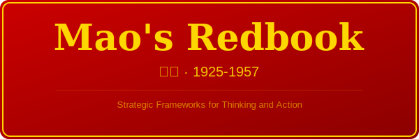

# 📕 Mao's Redbook · 毛选

<p align="center">
  
</p>

> *A strategic thinking toolkit extracted from 1,258 pages across 5 volumes (1925–1957). Frameworks for dialectical analysis, competitive strategy, and organizational leadership.*
> *从《毛泽东选集》1–5 卷中提取的战略思维工具箱。用于辩证分析、竞争策略和组织领导。**

[]()
[]()
[]()
[]()
[]()

---

## 🎯 What Is This?

This is **not** a book summary. It is a **thinking toolkit** — a structured extraction of frameworks, principles, and strategic methods from Mao Zedong's collected works, designed for use by AI agents (Claude Code, Copilot, Amp) and human thinkers alike.

这不是书摘。这是一个**思维工具箱**——从毛泽东著作中提取的框架、原则和战略方法的结构化知识库，供 AI 代理和人类思考者使用。

---

## 🌍 Why This Matters for Western Thinkers

Mao Zedong is one of history's most consequential strategic thinkers — yet in the West, his work is almost never studied as a **thinking methodology**. This is a mistake.

Five reasons to take this seriously:

| Reason | Why It Matters |
|--------|---------------|
| **1. Contradiction Analysis is a Superpower** | The West defaults to either/or thinking. Mao's dialectical method — find the principal contradiction, identify which side dominates, create conditions for transformation — is a more powerful tool for complex, multi-factor problems than any SWOT or 2x2 matrix. |
| **2. Asymmetric Strategy is Universally Applicable** | Mao won against superior forces for 22 years. His principles of concentration, protracted engagement, and turning weakness into strength apply directly to startups vs. incumbents, challenger brands, and underdog competition. |
| **3. The Mass Line is Lean Methodology, 70 Years Early** | "From the masses, to the masses" — investigate, concentrate, implement, verify — is the same iterative loop that modern product development calls "build-measure-learn." Just applied to revolution instead of software. |
| **4. These Ideas Shaped Modern China** | Understanding how China's leaders think requires understanding the intellectual toolkit they were trained on. The frameworks in this repo are not historical artifacts — they are live operating system for the world's second-largest economy. |
| **5. The Frameworks Are Methodologically Neutral** | You don't have to agree with Mao's politics or historical conclusions. The analytical method — investigate reality, identify contradictions, resolve the principal one — stands on its own as a thinking toolset, just as Sun Tzu's *Art of War* is studied by people who will never command an army. |

**Bottom line:** This isn't about ideology. It's about expanding your strategic repertoire with frameworks that have been battle-tested across one of history's most turbulent periods.

---

## 🧰 What's Inside

| File | Content |
|------|---------|
| `SKILL.md` | Agent skill definition — when and how to use this knowledge |
| `CHEATSHEET.md` | One-page bilingual quick reference card |
| `frameworks/` | 5 core frameworks with application templates |
| `glossary.md` | Key terms and concepts explained |
| `ARTICLE_INDEX.md` | Complete article listing across all 5 volumes |
| `_raw/` | Extracted source text (for reference and verification) |

### The Five Frameworks

| # | Framework | 中文 | Core Question It Answers |
|---|-----------|------|--------------------------|
| 1 | Contradiction Analysis | 矛盾论 | How to untangle complex, multi-factor problems? |
| 2 | Practice Theory | 实践论 | How to close the gap between theory and reality? |
| 3 | Military Strategy | 军事战略 | How to compete when outnumbered or out-resourced? |
| 4 | Mass Line | 群众路线 | How to stay connected to real needs and feedback? |
| 5 | United Front | 统一战线 | How to build coalitions while maintaining independence? |

---

## 🚀 Quick Start

### As a Claude Code Skill

```bash
# Already installed? Just reference it:
"Analyze this competitive situation using Mao's contradiction analysis framework"
```

### As a Thinking Toolkit

1. Open `CHEATSHEET.md` for the one-page overview
2. Dive into `frameworks/` for deep application guides
3. Search `ARTICLE_INDEX.md` for specific articles

---

## 📖 Essential Reading (Top 10)

| # | Article | English | Why Read |
|---|---------|---------|----------|
| 1 | 实践论 | On Practice | Foundation of how knowledge works |
| 2 | 矛盾论 | On Contradiction | Foundation of dialectical thinking |
| 3 | 论持久战 | On Protracted War | Masterclass in long-game strategy |
| 4 | 反对本本主义 | Oppose Book Worship | Anti-dogmatism manifesto |
| 5 | 中国革命战争的战略问题 | Problems of Strategy | Core military/competitive strategy |
| 6 | 论十大关系 | On the Ten Major Relationships | Systems thinking in practice |
| 7 | 关于领导方法的若干问题 | On Methods of Leadership | How to lead and make decisions |
| 8 | 中国社会各阶级的分析 | Analysis of Classes | How to analyze stakeholders |
| 9 | 关于正确处理人民内部矛盾 | On Correctly Handling Contradictions | Conflict resolution as dialectics |
| 10 | 改造我们的学习 | Reform Our Study | How to think clearly |

---

## 🎨 Design Philosophy

- **Extract structure, not summaries** — frameworks and methods over book reports
- **Bilingual accessibility** — all core content in Chinese + English
- **Application-first** — every framework includes "When to Apply" and templates
- **Information-dense but scannable** — tables, diagrams, checklists over prose

---

## ⚠️ Context Note · 语境说明

These writings span China's revolutionary period (1925–1957). The frameworks are extracted for their **analytical and strategic value**, abstracted from their specific historical and political context. 

Apply the dialectical method and strategic principles — not the historical conclusions.

---

## 📁 Project Structure

```
mao-zedong-selected-works/
├── README.md              ← You are here
├── SKILL.md               ← Agent skill (maos-redbook)
├── CHEATSHEET.md          ← Bilingual quick reference
├── glossary.md            ← Key terms explained
├── ARTICLE_INDEX.md       ← Complete article listing
├── assets/logo.svg        ← Project logo
├── frameworks/
│   ├── contradiction-analysis.md
│   ├── practice-theory.md
│   ├── military-strategy.md
│   ├── mass-line.md
│   └── united-front.md
├── chapters/
│   ├── vol1/              ← 17 articles (1925–1937)
│   ├── vol2/              ← 38 articles (1937–1941)
│   ├── vol3/              ← 30 articles (1941–1945)
│   ├── vol4/              ← 58 articles (1945–1949)
│   └── vol5/              ← 71 articles (1949–1957)
└── _raw/                  ← Source extraction data
```

---

## 🙏 Source

Based on 《毛泽东选集》(1–5 卷), 人民出版社 edition, digitized by 草堂闲人 (2010).

*Extracted and structured for educational and analytical purposes.*
